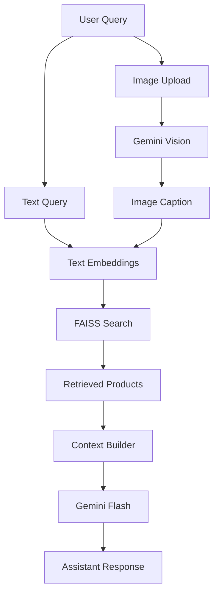

# 🛍️ Multimodal RAG for E-commerce Product Assistant

An AI-powered shopping assistant that combines **Google Gemini Vision**, **Retrieval-Augmented Generation (RAG)**, and **FAISS Vector Search** to understand both **images and text**. Users can upload product images or ask natural language queries to receive intelligent product recommendations.

> **ChatGPT + Google Lens + Amazon Search**

🌐 Live Demo:  https://multimodal-rag-shopping-assistant.onrender.com

##  Features

- 📷 Image-based product search using Gemini Vision
- 💬 Natural language product search
- 🧠 Hybrid Retrieval (Semantic + Keyword Search)
- 🔍 FAISS Vector Database for fast similarity search
- 🤖 AI-generated recommendations using Gemini Flash
- 🌐 Interactive Streamlit Web UI
- 📡 FastAPI REST API


##  Architecture




## Workflow

1. Upload an image or enter a text query.
2. Gemini Vision generates image captions and attributes.
3. Text is converted into embeddings.
4. FAISS retrieves the most relevant products.
5. Retrieved products are used to build context.
6. Gemini Flash generates personalized recommendations.


## Project Structure

```text
multimodal-rag-ecommerce/
├── api/
├── data/
├── embeddings/
├── evaluation/
├── frontend/
├── image_processing/
├── models/
├── rag/
├── utils/
├── vector_store/
├── deployment/
├── tests/
├── notebooks/
├── requirements.txt
├── README.md
└── .env
```

## Quick Start

```bash
git clone https://github.com/yourusername/multimodal-rag-ecommerce.git

cd multimodal-rag-ecommerce

python -m venv venv

# Windows
venv\Scripts\activate

pip install -r requirements.txt
```

Create a `.env` file:

```text
GOOGLE_API_KEY=YOUR_API_KEY
```

Generate embeddings:

```bash
python -m embeddings.generate_embeddings
```

##  Run the Project

### Streamlit

```bash
streamlit run frontend/streamlit_ui.py
```

### FastAPI

```bash
uvicorn api.main:app --reload
```

Swagger UI:

```
http://localhost:8000/docs
```


## Tech Stack

| Category | Technology |
|-----------|------------|
| LLM | Gemini Flash |
| Vision | Gemini Vision |
| Vector DB | FAISS |
| Embeddings | all-MiniLM-L6-v2 |
| Backend | FastAPI |
| Frontend | Streamlit |
| Language | Python |
| Deployment | Docker, Render |


## 🚀 Future Improvements

- User authentication
- Voice-based product search
- Multi-language support
- Product comparison
- Recommendation history
- Cloud deployment


## 📄 License

This project is licensed under the **MIT License**.
